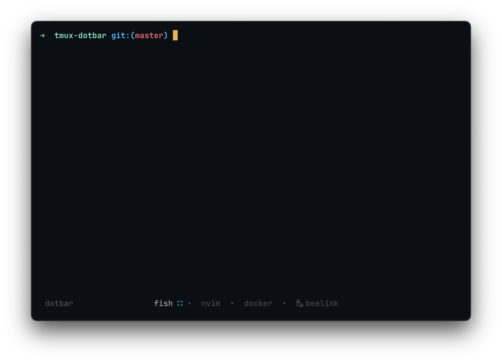
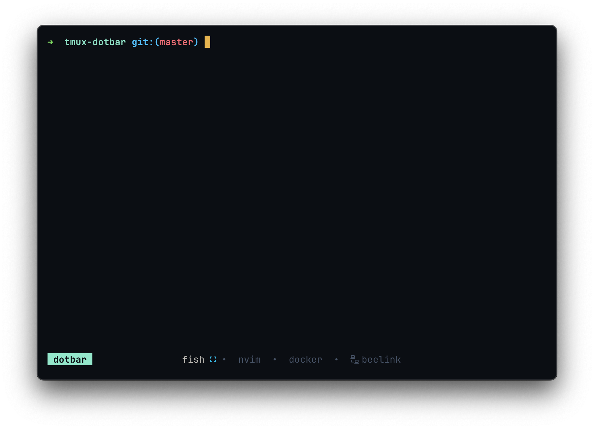

<div align="center">

<h1> tmux dotbar </h1>

tmux dotbar is a simple and minimalist status bar theme for tmux. <br>

[](./LICENSE)

</div> 

## Preview
<div align="center">
  
  
</div>


## Features
* Icon indicator when a pane is maximized in a window
* Color indication when tmux prefix is pressed
* Bell and activity notifications properly displayed with custom styles

## Installation
### TPM (recommended)
1.  Install [TPM](https://github.com/tmux-plugins/tpm)
2.  Add the plugin:

    ```bash
    set -g @plugin 'vaaleyard/tmux-dotbar'
    ```
3. Inside tmux, use the tpm install command: `prefix + I` (default prefix is ctrl+b)

<details>
    <summary font-size=18px>
        <h3>Manual</h3>
    </summary>

1. Clone this repository to your desired location (e.g. `~/.config/tmux/plugins/tmux-dotbar`).

   ```bash
   mkdir -p ~/.config/tmux/plugins/
   git clone https://github.com/vaaleyard/tmux-dotbar.git
   ```
2. Add the following line to your `tmux.conf` file:
   `run ~/.config/tmux/plugins/tmux-dotbar/dotbar.tmux`.
3. Reload Tmux by either restarting or reloading with `tmux source ~/.tmux.conf`.

</details>

## Configuration
### Colorscheme
This theme works best depending on the colorscheme you use, because the status-bar background is supposed to mix with the terminal background.
The default colorscheme used for this theme (as in the preview images) is [neovim-ayu](https://github.com/Shatur/neovim-ayu), so it matches the background for my tmux, terminal and vim colors.  
It's **strongely recommended** to change the colors so it matches your colorscheme. You can get the colors from the theme palette and change/set these options:
```
# supposing you use catppuccin moccha
set -g @tmux-dotbar-bg "#1e1e2e"
set -g @tmux-dotbar-fg "#585b70"
set -g @tmux-dotbar-fg-current "#cdd6f4"
set -g @tmux-dotbar-fg-session "#9399b2"
set -g @tmux-dotbar-fg-prefix "#cba6f7"
```

You can also set `@tmux-dotbar-bold-status` to use bold font in the statusbar, or `@tmux-dotbar-bold-current-window` to use bold font just for the present (active) window.

### Status bar
You may feel the right part a bit empty. If you want, there's an option to display the current time there, you can enable it (disabled by default) in your `.tmux.conf`:
```
set -g @tmux-dotbar-right true
```
If you want to change it completely, you can, just modify the variable `tmux-dotbar-status-right` accordingly.
Another option you might want to try is to change the position of the status-bar with `tmux-dotbar-position` (bottom by default):
```
set -g @tmux-dotbar-position top
```

### All options
Below are all the options you can change with the default values. You can look at `dotbar.tmux` for more reference.
```
set -g @tmux-dotbar-fg "#0B0E14"
set -g @tmux-dotbar-bg "#475266"
set -g @tmux-dotbar-fg-current "#BFBDB6"
set -g @tmux-dotbar-fg-session "#565B66"
set -g @tmux-dotbar-fg-prefix "#95E6CB"
set -g @tmux-dotbar-position "bottom"
set -g @tmux-dotbar-justify "absolute-centre"
set -g @tmux-dotbar-left "true"
set -g @tmux-dotbar-status-left "#S" # see code
set -g @tmux-dotbar-right "false"
set -g @tmux-dotbar-status-right "%H:%M" # see code
set -g @tmux-dotbar-window-status-format " #W "
set -g @tmux-dotbar-window-status-separator " • "
set -g @tmux-dotbar-maximized-icon "󰊓"
set -g @tmux-dotbar-show-maximized-icon-for-all-tabs false
set -g @tmux-dotbar-bold-status true
set -g @tmux-dotbar-bold-current-window false
```

## Recommended tmux options
Since this theme does not display window indexes, it's best suited for users who manage a small number of windows.  
To improve usability, it's hugely recommended to enable automatic renumbering when windows are closed.  
Also a good option is to start window indexes at 1 for easier tracking.

```
set-option -g renumber-windows on
set -g base-index 1
setw -g pane-base-index 1
```

### Credits
This theme was inspired on [minimal-tmux-status](https://github.com/niksingh710/minimal-tmux-status/tree/main).
